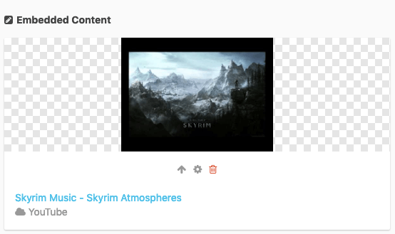

# oEmbed Field for [Cockpit](https://github.com/agentejo/cockpit)

Uses noembed api https://noembed.com/.  
This is mostly untested, I just needed a quick solution. Feel free to improve !



## Installation

```
$ cd cockpit/modules/addons
$ git clone git@github.com:DrMartinGonzo/field-oembed.git
```

_Note: Directory must be named **field-oembed** for Cockpit to register addon._
